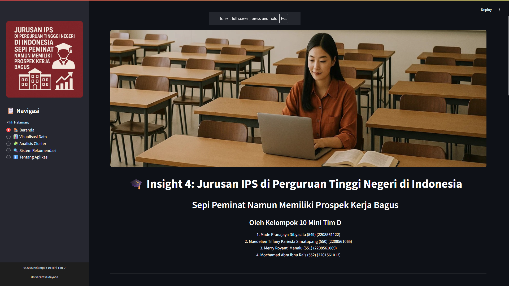

<div align="center">
  
  <h1>Insight-PTN</h1>
  <p>Analisis dan visualisasi jurusan IPS di Perguruan Tinggi Negeri Indonesia yang sepi peminat namun memiliki prospek kerja bagus.</p>
  
  [](https://www.python.org/downloads/)
  [](https://streamlit.io/)
  [](LICENSE)
</div>

## 📋 Tentang Aplikasi

Aplikasi Insight-PTN adalah dashboard interaktif yang membantu calon mahasiswa menemukan jurusan IPS di PTN Indonesia yang sepi peminat namun memiliki prospek kerja yang bagus. Aplikasi ini menampilkan visualisasi data, analisis cluster, dan sistem rekomendasi untuk membantu pengambilan keputusan.

<div align="center">
  
</div>

## ✨ Fitur Utama

- 📊 **Visualisasi Data** - Eksplorasi berbagai visualisasi interaktif dari data jurusan IPS di PTN
- 🗺️ **Distribusi Geografis** - Pemetaan lokasi jurusan di seluruh Indonesia
- 🧩 **Analisis Cluster** - Pengelompokan jurusan berdasarkan karakteristik serupa
- 🔍 **Sistem Rekomendasi** - Rekomendasi jurusan berdasarkan preferensi pengguna

## 🚀 Cara Menjalankan Aplikasi

### Prasyarat

- Python 3.8+
- pip

### Langkah-langkah

1. Clone repository
   ```bash
   git clone https://github.com/your-username/insight-ptn.git
   cd insight-ptn
   ```

2. Buat virtual environment (opsional tapi disarankan)
   ```bash
   python -m venv venv
   source venv/bin/activate  # Linux/Mac
   venv\Scripts\activate     # Windows
   ```

3. Install dependensi
   ```bash
   pip install -r requirements.txt
   ```

4. Latih model machine learning
   ```bash
   python train_models.py
   ```

5. Jalankan aplikasi Streamlit
   ```bash
   streamlit run app.py
   ```

6. Buka browser dan akses `http://localhost:8501`

## 📊 Dataset

Dataset berisi informasi tentang 411 program studi IPS dari 62 PTN di Indonesia, mencakup:
- Jumlah peminat dan daya tampung
- Rasio keketatan masuk
- Tingkat kelulusan dan lama studi
- Gaji awal dan prospek kerja
- Berbagai faktor lain terkait prospek karir

## 👨‍👩‍👧‍👦 Tim Pengembang

**Kelompok 10 Mini Tim D**
- Made Pranajaya Dibyacita (549) (2208561122)
- Maedelien Tiffany Kariesta Simatupang (550) (2208561065)
- Merry Royanti Manalu (551) (2208561069)
- Mochamad Abra Ibnu Rais (552) (2201561012)

## 📄 Lisensi

Proyek ini dilisensikan di bawah Lisensi MIT - lihat file [LICENSE](LICENSE) untuk detail.